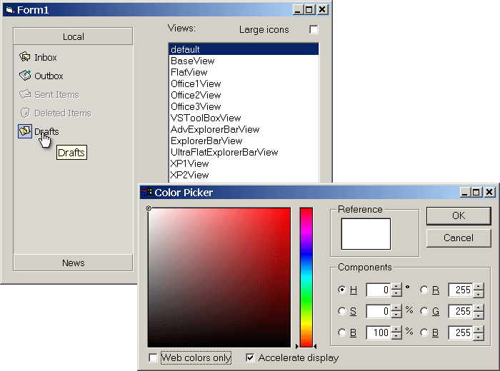



## Double Dragon: Outlook Bar control \+ Photoshop Style Color Picker \(now WITHOUT help file\!\)

### Description

UPDATE(2002-12-26): Version 1.3.2 Fixes incorrect painting and adds absolute positioning for tiled bitmaps.

----

UPDATE(2002-11-12): Version 1.3.1 Fixes gradient fills under legacy OSes (NT 4.0 and Win 95).

----

UPDATE(2002-11-05): Version 1.3 Label edit fully implemented! Brand new subclasser working ok in MS Office and VS.NET so this one should fix the problems. Out-of-focus mouse wheel support (Outlook style). OLE Drag&Drop of groups implemented. cButton.Key property synced with parent collection. New properties: LabelEdit, AllowGroupDrag, GroupHilightIdx. Additional background style: ucsGrdTileBitmap. Bugfixes (including cMemDC). Help file updated.

----

UPDATE(2002-08-09): Version 1.2 Automatic OLE Drag&Drop fully implemented!!! New properties: UseSystemFont, FlatScrollArrows, WrapText. Additional background styles: ucsGrdAlphaBlend, ucsGrdStretchBitmap. Bugfixes and new samples. Help file updated.

----

UPDATE(2002-07-24): Version 1.1 Help file included. Additional background options. cMemDC bugfixes. VB bugfixes: now icons can also be 256 colors and truecolor.

----

This is a fairly complete emulation of outlook bar. This control is fully customizable and can emulate both outlook xp and 2000 button bar (see "more samples") and then goes beyond. Control customization is accessible through couple of property pages. Featured is a hierarchical model (much like CSS) for defining formats of control elements (including hover/pressed/selected formats on group/items) which can be persisted (an .obf file) and a polymorphic object model for representation of group and item buttons data. Multi-line captions, multi-line tooltips (API), large&small icon styles, single/double/fixed bordes, horizontal/vertical gradients. Help is to be done (generated:-)) shortly. OLEDrag&Drop is in its infancy but still workable. Also, here you have it: the *realtime* color picker re-submitted as part of the outlook bar property pages -- check it out it's fast! Also, check out the error handler (robust one) and the DebugMode object leak info system. Has been checked on win2k for GDI leaks (win9x to be done, anyone?). This is in response to recent submissions of "commercial quality" and "industrial strength" software to this site. Although not complete the project could easily become commercial one. Greetings go to: Ariad Software (now www.cyotek.com), vbAccelerator.com (great inspiration), and Carles P.V. (for his controls submissions:-)). Read readme.txt for the build procedure. Please report bugs and problems and leave your votes!
 
### More Info
 

             |
---                |---
**Submitted On**   |2002-12-26 17:02:38
**By**             |[Vlad Vissoultchev](https://github.com/Planet-Source-Code/PSCIndex/blob/master/ByAuthor/vlad-vissoultchev.md)
**Level**          |Intermediate
**User Rating**    |5.0 (1287 globes from 259 users)
**Compatibility**  |VB 6\.0
**Category**       |[Custom Controls/ Forms/  Menus](https://github.com/Planet-Source-Code/PSCIndex/blob/master/ByCategory/custom-controls-forms-menus__1-4.md)
**World**          |[Visual Basic](https://github.com/Planet-Source-Code/PSCIndex/blob/master/ByWorld/visual-basic.md)
**Archive File**   |[Double\_Dra15192312272002\.zip](https://github.com/Planet-Source-Code/vlad-vissoultchev-double-dragon-outlook-bar-control-photoshop-style-color-picker-now-witho__1-36529/archive/master.zip)

